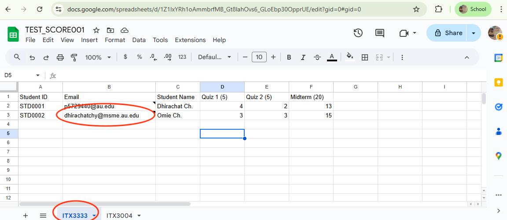
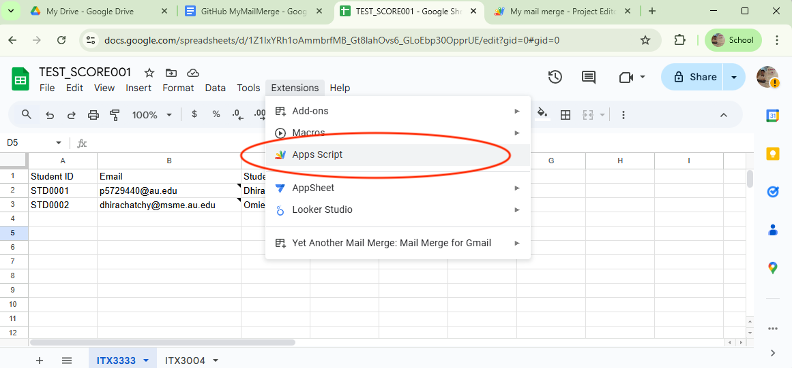
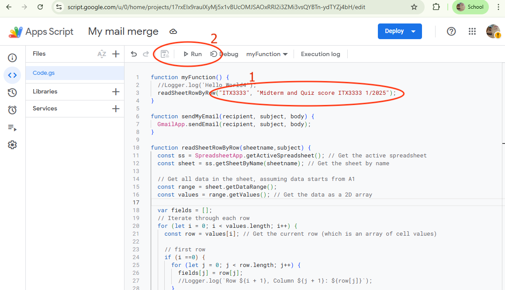
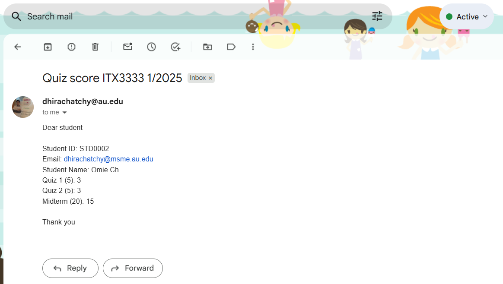

# MyMailMerge
This is simple mail merge to send the email regarding student scores. This is to avoid PDPA issue, the student will know his/her score only.

### Prerequisites

You need to have Google acccount that can use Google Sheet.
## Usage

1. You Google Sheet must have header row. ** Second column is email address. ** It is recommended that you make the meaningful sheet's name.

2. Go to menu click "Apps script"

3. Copy the source code in file "Code_gs.js". Do not forget to change "sheet name" and "email's subject". 

4. Click "Save" an "Run", you will send email to the address in second column, one by one. The email content is column headers with data in each row. 

(<a href="#readme-top">back to top</a>)

<!-- CONTRIBUTING -->
## Contributing

Contributions are what make the open source community such an amazing place to learn, inspire, and create. Any contributions you make are **greatly appreciated**.

If you have a suggestion that would make this better, please fork the repo and create a pull request. You can also simply open an issue with the tag "enhancement".
Don't forget to give the project a star! Thanks again!

1. Fork the Project
2. Create your Feature Branch (`git checkout -b feature/AmazingFeature`)
3. Commit your Changes (`git commit -m 'Add some AmazingFeature'`)
4. Push to the Branch (`git push origin feature/AmazingFeature`)
5. Open a Pull Request

(<a href="#readme-top">back to top</a>)

<!-- LICENSE -->
## License

Distributed under the project_license. See `LICENSE.txt` for more information.

(<a href="#readme-top">back to top</a>)

<!-- CONTACT -->
## Contact

Dhirachat Ch. - omiejung@gmail.com

Project Link: https://github.com/omiejung01/MyMailMerge/

(<a href="#readme-top">back to top</a>)

